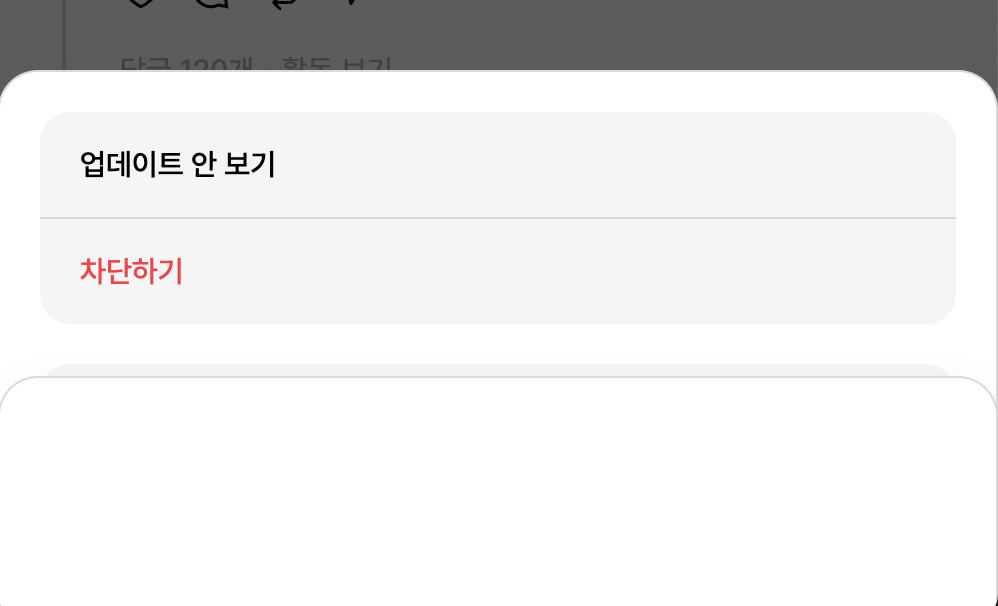
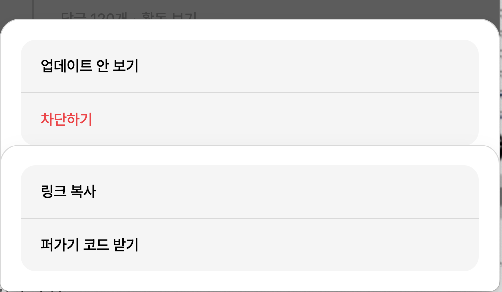

# 문제 해결 로그

#### #0 Issue
<hr>

*Issue* : 
<br>
- **Next.js Route Groups** 사용 시, 맥북 내부에서 favicon.ico 적용 안되는 문제 존재

<br>

*Solved* : 
<br>
- 라우팅 그룹핑을 했기 떄문에, index.ts 파일을 각 라우트 그룹 내부에 넣게되고, 가장 app 폴더 상단에 위치하는 index.ts는 삭제한 후 적용이 안됨
- [Github Next.js Issues #59089](https://github.com/vercel/next.js/issues/59089) 참고하여 문제 해결 완료
- [favicon.io](https://favicon.io/) 홈페이지에서 다운 받은 폴더들 중 `apple_touch_icon.png` 파일을 `apple-icon.png`로 수정하여 app 상단에 위치시켰더니 정상적으로 출력 완료
- 맥북에서만 생기는 문제인지, 윈도우에서도 똑같이 적용되는지는 파악하지 못함
<br>
<br>

#### #1 Issue
<hr>

*Issue* : 
<br>
- svg파일 import시, fill, stroke, className 적용 문제

<br>

*Solved* : 
<br>
- next/image에서 import 해온 Image 사용해서 fill, stroke 적용되지 아니함 
- 구글링 후, svg path 내부에 fill="current" stroke="current" 설정해보았지만 적용 실패
- npm/yarn install로 @svgr/webpack 패키지 설치해보았으나 적용 실패
- [Github Next.js Issues #48177](https://github.com/vercel/next.js/issues/48177) 참고하여 문제 해결 완료
- 구글링 블로그글에는 패키지를 설치 후, next.config.ts 내부에 해당코드를 붙이면 된다고 했지만, compile 오류 발생

```typescript

 webpack: (config) => {
    config.module.rules.push({
      test: /\.svg$/i,
      issuer: /\.[jt]sx?$/,
      use: ["@svgr/webpack"],
    });
    return config;
  },
```

- 해결법은 두가지가 존재하는데, 코드로 예시를 들면
1. import문 `import ThreadsLogo from "../../public/threads_logo.svg";`의 svg 뒤쪽에 `?svr`를 붙여주기
- `import ThreadsLogo from "../../public/threads_logo.svg?svr";`
2. `next.config.ts` 폴더 내부 webpack에서 issuer 부분 제거
- 이 경우는, `../../public/threads_logo.svg`로도 import 가능

<br>

#### #2 Issue
<hr>

*Issue* : 
<br>

- 해결되었던 stroke 미적용 이슈 다시 발생

<br>

*Solved* : 
<br>

- fill은 정상 작동하지만 stroke 적용 이슈 발생
- `global.css`에 svg light theme, dark theme color 지정해준 다음
- svg내부 stroke="currentColor" 설정 후
- consts 정의 해준 icon별 variants `stroke-` 형식 정의 `text-`로 변경
- 컬러 적용 완료, 다만 stroke-width는 className에 아무리 적용해줘도 반영되지 않는 이슈 존재해서
- path에 각각 `stroke-width="8"` 적용 시킴

<br>

#### #3 Issue
<hr>

*Issue* : tailwind.config.ts 커스텀 한 이후, 기존 tailwindcss theme 적용되지 않는 문제 존재

<br>

*Solved* : 
<br>

- tailwindcss 기존 theme 유지하면서, 추가하고 싶은 경우에는
```typescript
module.exports ={
  content : [
    // ...
  ],
  theme {
    extend : {
      // 기존 theme 유지하면서 커스텀 추가할 떄
    },
    // 외부에 정의하는 경우에는 기존 theme은 사라짐
  }
}
```
- theme/extend 내부에 정의 해주면 기존 `h-full` 등과 같은 theme이 잘 적용되는 것을 확인할 수 있음

<br>

#### #4 Issue
<hr>

*Issue* : next/Image Image 사용하여 overflow-x-scroll 적용시 캐러셀 이미지 사라지는 이슈

<br>

*Solved* : 
<br>

- Image 태그 사용해서 해결하는 방법 결국 찾지 못해서, img 태그로 변경
- img 부모 요소에 flex-shrink: 0; 사용하여 현재, 전체 레이아웃이 flex로 잡혀있어 기본값으로 해당 최상단 부모요소의 레이아웃 벗어나지 않게 설정되어있는 문제 해결
- width: 50%로 배율 사용하고 height: auto; 사용해서 비율 유지 하면서 스크롤 되게끔 설정 완료

<br>

#### #5 Issue
<hr>

*Issue* : ThreadCard Header 부분 더보기 아이콘 클릭 시 DropDown 컴포넌트 중복 문제



<br>

*Solved* : 
<br>

- ThreadCard Header 부분 더보기 아이콘 클릭 시 중복 호출 문제 존재
- 문제가 되는 코드로 추측 되는 부분
```typescript

   {/* 아이콘 클릭시 dropdown clicked 상태 변경 관리 */}
    const [isClicked, setIsClicked] = useState({
      0: false,
      2: false,
      3: false,
    });


    {/* threads card header */}
      <div className="flex-initial flex justify-between items-center">
        <p className="dark:text-[#FFFFFF] text-[#101010] text-[15px] font-medium hover:underline cursor-pointer">
          { threadData?.userId }
        </p>
        <div className='flex items-center'>
          <p className='dark:text-dark-navicon text-light-navicon justify-self-center tracking-[-0.18px]'>{threadData?.createdTime}시간</p>
          <button className='ml-[5px] p-[8px] rounded-[50%] hover:dark:bg-dark-icon-hover hover:bg-light-icon-hover' onClick={() => handleMenuClick(0)}><ThreadDetailBtn className="w-[20px] h-[20px] dark:stroke-[#FFFFFF] stroke-[#101010]"/></button>
          { isClicked[0] && <DropDown content={dropDownMenus.threadHeader} popup header /> }
        </div>
      </div>

    {/* threads Icons Area */}
      <div className="mt-[10px]">
        <ul className="flex relative -left-[7px]">
          { threadContentIcons.map((item, idx) => {
            return (
              <div key={nanoid()} className='relative'>
                <button className='hover:dark:bg-dark-icon-hover hover:bg-light-icon-hover p-[5px] rounded-[50%]' onClick={() => handleMenuClick(idx)}>{item.icon}</button>
                { isClicked[idx] && <DropDown content={idx === 2 ? dropDownMenus.threadRepost : idx === 3 ? dropDownMenus.threadSend : null } popup repost={item?.name === 'repost'} /> }
                {/* thread card 내부에서 content으로 prop 받아오는데 item.name 삼항연산자 사용하면서 그 외의 값 null로도 또 보내줘서 popup이 두개 생성되는 오류 존재했었음 */}
              </div>
            )
          })}
        </ul>
      </div>
```
1. threadCard Header 부분의 `content={dropDownMenus.threadHeader}`전달 / threadCard Icons Area 부분의 삼항연산자 조건식에서 `content={null}`값 전달로 인한 겹침 현상
2. isClicked 상태 변경 관리 부분에서 idx를 키값으로 잡았기 때문
3. 타입 정의가 되어있지 않아 발생한 문제
<br>

- 1번 문제 해결 위해 `isClicked[idx] && <DropDown content={idx === 2 ? dropDownMenus.threadRepost : dropDownMenus.threadSend }` 로 수정



- idx === 0이 클릭되었는데 idx === 3 도 중복 호출 현상 여전히 지속
- idx로 Object 키값 설정하는 것이 아닌 다른 유니크한 값으로 키값 설정하니 문제 해결 완료
- idx로 삼항연산자를 사용하게 되는경우 idx === 2를 제외한 모든 값이 `:` 기준으로 오른쪽 값으로 지정되기 떄문에 like버튼이나 message 버튼을 눌렀을때도 send의 값이 지정되는 것 확인
- disabled를 사용해서 우선 idx <= 1의 경우는 버튼 막아두는것으로 임시 설정 완료


